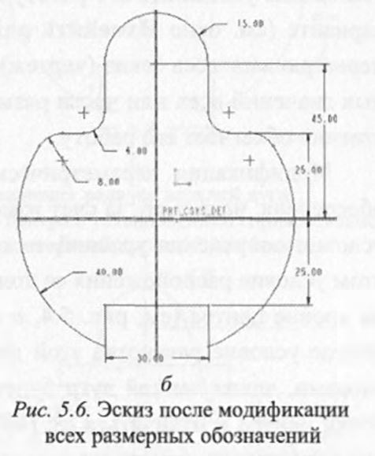
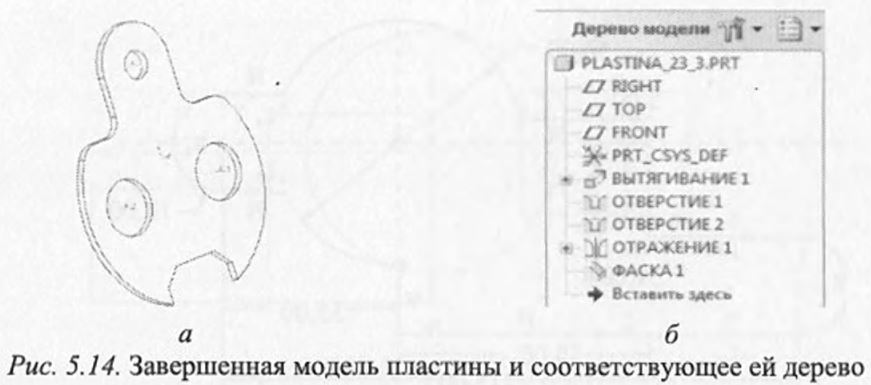
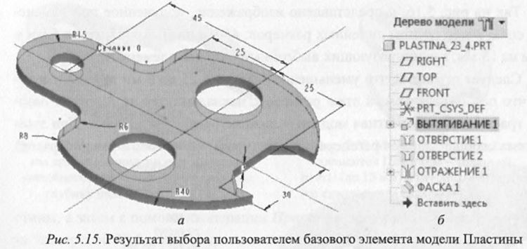
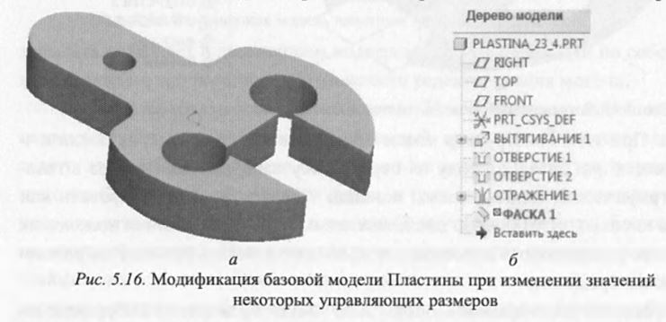
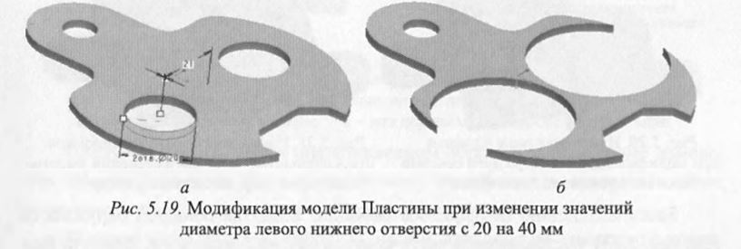
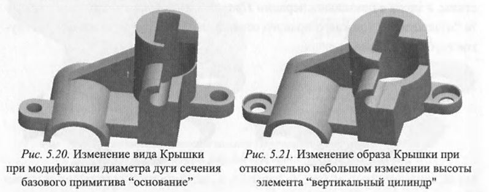
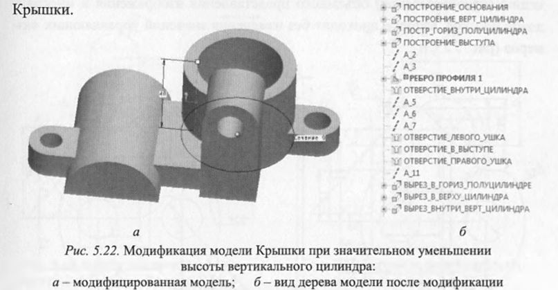

# Вопрос 24: Модификация параметрических описаний объемных объектов

Функция модификации обеспечивает автоматическую перерисовку созданного параметрического графического объекта при изменении какого-либо типа ограничения , накладываемого на элементы изображенного объекта. Наиболее часто для модификации моделей используют изменения размерных и топологических ограничений, но иногда применяют функциональные и логические. Так модификация параметрической модели объекта производится при изменении значения одного или всех определяющих форму этого объекта размерных обозначений, если новые задаваемые значения не противоречат друг другу. Работа этой функции обеспечивается тем, что во внутренней структуре параметрических систем конкретные параметры всех графических примитивов, необходимые для их перерисовки с новыми значениями, представлены в зависимости от параметров (размеров), используемых в сформированном параметрическом описании.
Модификация изображений может обеспечиваться параметрическими системами как на уровне сечений базовых объемных графических примитивов, так и на уровне их 3D-представления.

На основе сформированного эскиза внешнего контура Пластины (см. рис. 5.6) с помощью операции его вытягивания в поперечном направлении строится параметрическая модель базового элемента пластины. При этом полученная параметрическая модель такого объемного тела полностью определяется совокупностью из девяти независимых параметров - 8 из них характеризуют внешний контур пластины, а девятый - ее толщину. Далее, чтобы получить законченную объемную параметрическую модель пластины (рис. 5.14, а), к модели первого построенного базового элемента добавляют еще 4 объемных параметрических базовых примитива - 3 отверстия и фаски, каждый из которых определяется своими параметрами и параметрами привязки к первому базовому элементу. В итоге в описание параметрической модели пластины входит 5 базовых объемных графических примитивов, что подтверждается пятью записями в дереве построенной модели (рис 5.14, 6).

Графический примитив “отражение 1” является объемной копией “отверстия 2”, но выступает здесь в виде самостоятельного объекта, так как в общем случае зеркальное отражение объемного элемента “отверстия 2” может осуществляться системой как без изменения (как в данном случае), так и с изменением параметров по отношению к его прототипу. Такая реализация отраженного элемента позволяет в дальнейшем подвергать его модификации по собственным правилам, что расширяет возможности редактирования модели.
Принципиально модель плоской детали Пластина можно выполнить используя только один графический объемный примитив. Для этого сечение такого элемента должно было бы состоять из внешнего контура, учитывающего необходимость образования фасок, и трех окружностей, соответствующих отверстиям, имеющимся в пластине (3 внутренних контура, вложенных во внешний контур). При этом контуры, образующие сечение, не должны взаимно пересекаться. Однако использование только одного относительно сложного сечения для формирования объемного примитива нецелесообразно, так как накладывает определенные ограничения на процессы модификации такой объемной модели.

#### Модификация детали Пластина
Модификация любой объемной параметрической модели сводится к изменению параметров объемных базовых примитивов, из которых состоит модель, и изменению параметров их взаимных привязок. При каждой операции модификации изменить параметры можно только у одного объемного базового примитива модели. Для этого пользователь должен выбрать этот примитив непосредственно на графическом изображении детали (рис. 5.15, а), представленной в области рабочего поля системы, либо в дереве модели (рис. 5.15, б), что сделать значительно проще.

В любом случае выбор приведет к выделению этого базового элемента и на изображении в графическом окне, и в дереве модели.
В этом режиме система параметризации предоставляет пользователю широкие возможности для модификации базового графического примитива. Вызвав контекстное меню (см. рис. 4.3), он может:
* править (изменять) значения управляющих размеров выбранного элемента. При этом конструктор может изменять значения размеров поодиночке, каждый раз давая команду на перерисовку изображения (выбрав в главном графическом меню системы команды Править => Регенерировать или нажав кнопки Ctrl + G), либо последовательно изменять значения нескольких или всех управляющих размеров, а только потом подать команду на регенерацию изображения;
- динамически править (оперативно изменять) значения выбранных им управляющих размеров. При этом система сразу же автоматически перерисовывает объект после ввода нового значения для выбранного размера;
- править определение операции построения выбранного элемента. В этом режиме система позволяет полностью переопределить все параметры по построению элемента в рамках операции, в которой он был построен. Для этого открывается окно параметров операции с отображением всех данных созданного ранее элемента. При этом пользователь может изменить параметры частично, скорректировав образ элемента, или полностью, существенно изменив форму элемента, т. е., по сути, создать совершенно новый элемент по форме, но в рамках старой операции.

Приведем ряд примеров модификации моделей различных деталей, полученных с помощью представленных средств.
Так выбор в контекстном меню операции Править приведет к выводу на экран всех размерных обозначений, характеризующих выбранный компонент (см. рис. 5.15, а). Далее, выбирая соответствующие размеры, можно изменять их значения, что позволит модифицировать сечение выбранного базового объемного элемента или его пространственные параметры.
Так на рис. 5.16, а представлено изображение, полученное при изменении следующей группы линейных размеров: 45 мм на 60 мм, 25 мм на 5 мм и 3 мм на 15 мм, характеризующих выбранный базовый элемент Пластины.

Следует отметить, что уменьшение размера с 25 до 5 мм приводит к тому, что паз, определяемый этим размером, накладывается на 3 других базовых графических примитива модели - нижние отверстия и фаски. При этом система сообщает о сбое регенерации некоторых элементов, а именно фасок, которые полностью поглощаются, и поэтому на экране соответствующая им строка отмечается в дереве модели красным цветом и значком “не отражаемая операция” (рис. 5.16, б). В связи с этим система предлагает отменить или принять полученный результат. В случае принятия такой модификации базового элемента пользователь без ущерба для полученного изображения может при желании удалить запись об элементе “фаска” из дерева модели. Параметрическое описание можно также модифицировать за счет смены знака и/или значений некоторых линейных размерных обозначений. В частности, на рис. 5.17 приведен пример такой модификации, которая выполняется системой без нарушения (сбоя) регенерации. Размерное число этого пара метра после модификации изображения принимает положительное значение. При этом элементы фаски в результирующем изображении сохраняются, в отличие от предыдущего варианта модификации (рис. 5.16, б).
К сожалению, на направление дуг изменение знака их радиуса никак не влияет, что снижает возможности системы по видоизменению формы детали.
Как указывалось ранее, модифицировать модель можно последовательно для различных базовых компонентов. Вариант такого изменения формы представлен на рис. 5.18. Здесь, как и ранее, вначале меняется толщина пластины, а затем с помощью операции Править определение параметр элемента “отверстие 2 ” (нижнего правого отверстия) меняется со сквозного на глухое глубиной 7,5 мм.

Другой вариант модификации модели Пластины может быть получен при изменении параметров нижнего левого (базового) отверстия (рис. 5.19, а) в режиме Динамически править с диаметра 20 на 40 мм (рис. 5.19, б).
При этом одновременно меняется и его копия. Размер диаметра отверстий в 40 мм выбран специально, чтобы показать, что система позволяет выполнять в базовом примитиве отверстия, выходящие за границы контура, а следовательно, получать деталь достаточно сложной формы.
Из примеров образов модифицированных моделей (рис. 5.16, б, 5.17 и 5.19, б) видно, что форма исходного объекта существенно изменилась. Этот эффект наблюдается только в случае, если исходная модель сформирована из нескольких отдельных базовых графических примитивов. При формировании пластины из одного объемного базового примитива нельзя было бы создать при модификации соответствующие образы, так как для этого в эскизе сечения примитива надо было бы задавать взаимно пересекающиеся контуры, чего параметрическая система не допускает.
#### Модификация детали Крышка
Некоторые особенности модификации параметрических моделей можно выявить на анализе преобразований Крышки (см. 5.1.3, рис. 5.9 и 5.10). Как видно из дерева модели этой детали (рис. 5.9, б, в), модель составлена из относительно большого количества объемных базовых составляющих ( 1 2 ), поэтому для ее модификации предоставляются большие возможности. Рассмотрим лишь некоторые из них, отличающиеся от ранее представленных. Так на рис. 5.20 представлен результат модификации основания Крышки (первого базового объемного примитива модели).

Здесь изменению подверглось значение диаметра большой окружности (см. рис. 5.13), составляющей часть контура сечения основания. Диаметр был уменьшен с 50 до 40 мм. Такое действие привело не только к модификации основания, но и к автоматическому уменьшению внешнего диаметра вертикального цилиндра, так как его построение основывалось на привязке к линии основания, принадлежащей большой окружности, и его внешний диаметр является наследником диаметра дуги основания. При этом соответственно уменьшилась толщина стенок вертикального цилиндра, так как размер диаметра его внутреннего выреза остался прежним - 35 мм.
Если операции Править необходимо подвергнуть непосредственно параметры объемного базового элемента “вертикальный цилиндр”, следует учесть, что он характеризуется только одним параметром - высотой. Отдельно размер диаметра цилиндра изменить нельзя, так как на него наложено ограничение - привязка к примитивам основания. Однако и высоту цилиндра нельзя менять произвольно в сторону уменьшения, так как этот параметр, в свою очередь, влияет на другие, построенные на его основе, элементы параметрической модели. Так минимальное значение его высоты должно быть не 96 менее 46 мм, чтобы не нарушались условия связи с другими базовыми объемными примитивами (рис. 5.21), в первую очередь с элементом “ребро профиля 1”. Однако и в этом случае может несколько искажаться конфигурация выреза, сделанного для наглядности, но не отраженного в дереве модели Крышки.

Следует отметить, что в представленном образе Крышки кроме изменения высоты цилиндра была осуществлена модификация отверстий обоих ушек с использованием операции Править определение.
В левом ушке простое отверстие было исправлено на отверстие с цековкой на глубину 5 мм, а в правом - на глубину 8 мм. Все эти модификации осуществлялись последовательно после выделения в описании (в рисунке или дереве модели) соответствующего базового элемента.
Если при операции Править в процессе модификации элемента “вертикальный цилиндр” детали Крышка задать значение высоты меньше уровня ребра, то модификация сопровождается сообщением об ошибках преобразования, так как часть зависимых от высоты цилиндра объемных примитивов система перерисовать не может. В этом случае пользователь может указать системе завершить модификацию, получив соответствующий результат (рис. 5.22, а), или отказаться от нее. Те примитивы, которые система не прорисовала, выделяются в дереве модели красным цветом, и пользователь может их удалить.
